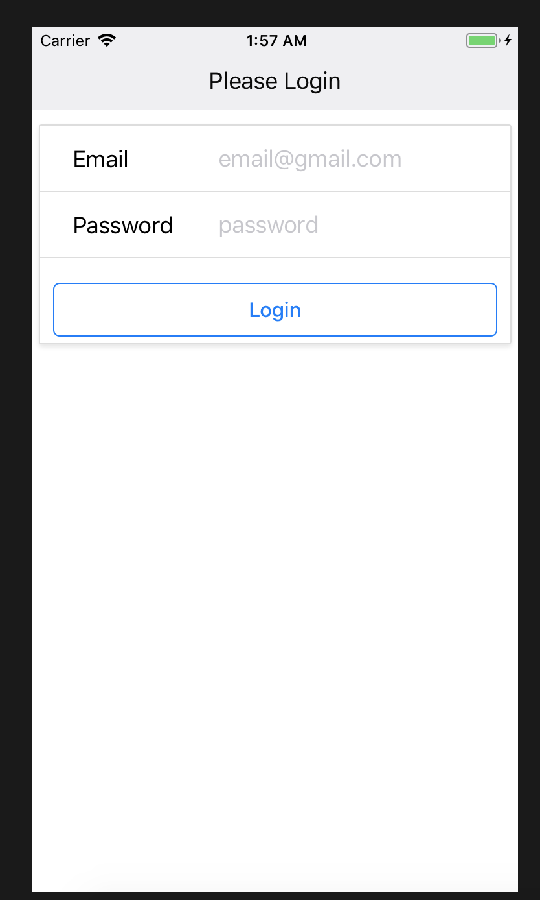
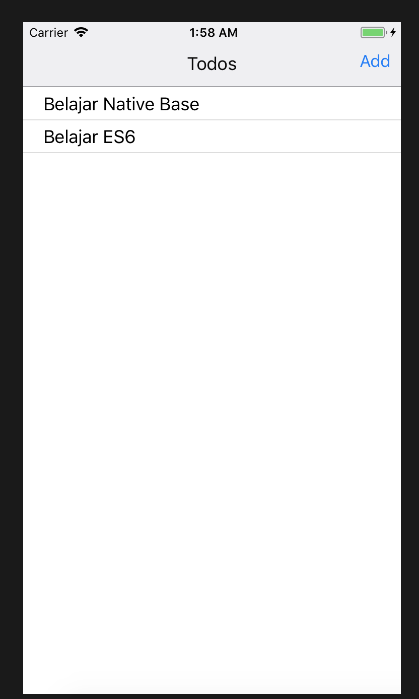
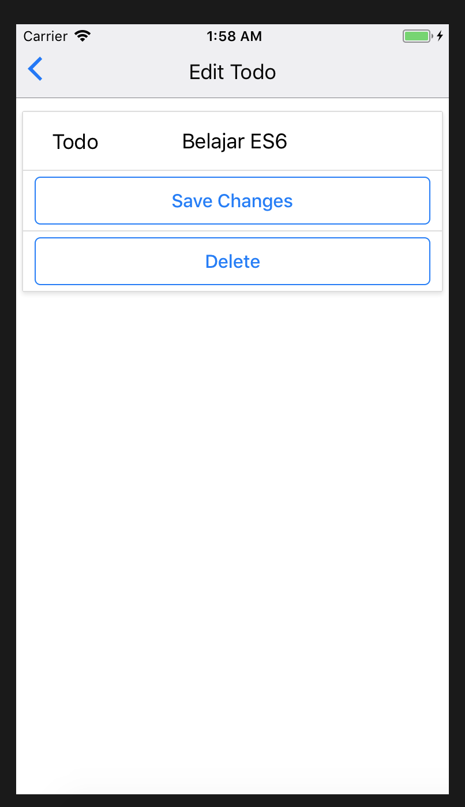

# React-Native-Firebase-Todo-List
Very Simple Todo List App Example Developed Using React Native and Firebase. To Show Very Simple CRUD process.

# Technology Stack

- React Native
- Firebase
- Redux
- React Redux
- Redux Thunk
- Lodash

# Screenshoots

# Install

- download / clone the repo
- change the firebase config with your own config './src/App.js'
- execute 'npm install'
- execute 'react-native run-ios' for IOS
- execute 'react-native run-android' for Android